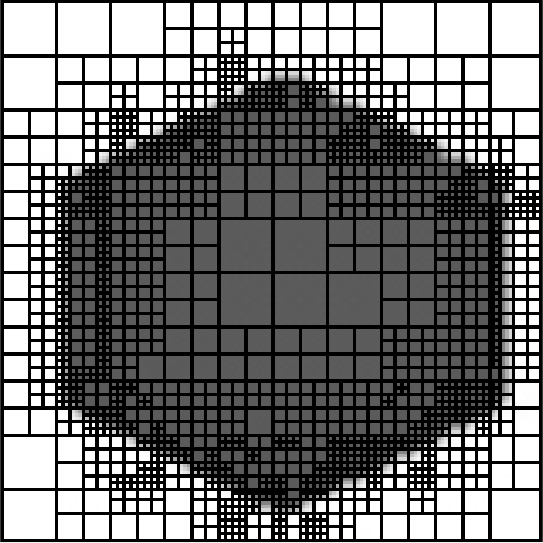

#### Task

Draw bitmap for given image using adaptive algorithm.

#### Results

#### Modifications

To modify this solution you can change `bitmap_h` function.

`bitmap_h` function requires such arguments:

1. `filename`
2. `elementsx, elementsy` - grid size;
3. `maxerror` - adaptation accuracy;
4. `max_refinement_level` - number of iterations of the algorithm;
5. `color_edges_black` - flag indicating whether the grid must be drawn;
