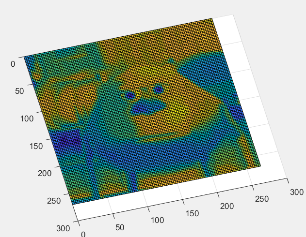

#### Task

Create 2D spline based on bitmap, generated for image.

#### Results




#### Modifications

To modify the curve you can change either `knot_vector` or `coeff_vector`.

Important notes:

- The number of repeating elements - `R` - at the beginning and at the end of the knot vector must be the same;
- The number `R-1` defines degree of the spline;
- Coefficients vector must contain `N + R-1` elements, where `N` is the number of ranges. For example:

  ```
  Knot vector: [0,0,0,1,2,3,4,5,5,5]
  Ranges: [0,1], [1,2], [2,3], [3,4], [4,5]
  Number of ranges: 5
  Degree of the spline: 2

  Coefficient vector should contain 7 elements
  ```
