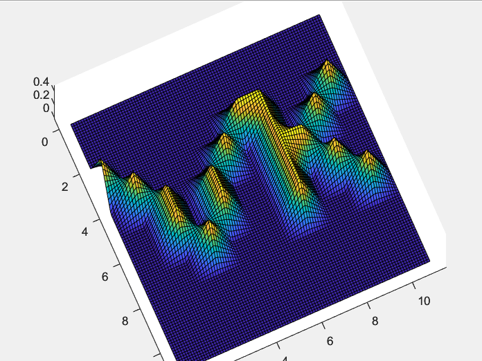

#### Task

Draw your initials using B-splines.

#### Results



#### Modifications

To modify the curve you can change either `knot_vectorx`, `knot_vectory` or `coeff_vector`.

Important notes:

- The number of repeating elements - `R` - at the beginning and at the end of the knot vector must be the same;
- The number `R-1` defines degree of the spline;
- Coefficients vector must be a 2D matrix containing `N_x + R_x - 1` rows and `N_y + R_y - 1` columns, where `N_x, R_x` and `N_y, R_y` is the number of ranges and degree for `knot_vectorx`, `knot_vectory` accordingly. For example:

  ```
  Knot vector x: [0,0,1,2,3,4,4]
  Ranges x : [0,1], [1,2], [2,3], [3,4]
  Number of ranges N_x: 4
  Degree: 1

  Knot vector y: [0,0,1,2,3,3]
  Ranges y: [0,1], [1,2], [2,3]
  Number of ranges N_y: 3
  Degree: 1

  Coefficient matrix should be 4x5
  ```
